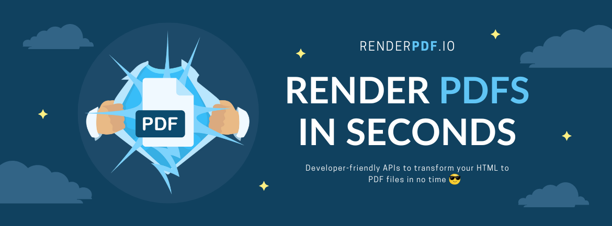

# Render HTML to PDF for PHP - RenderPDF.io PHP Library




[RenderPDF.io](https://renderpdf.io) provides awesome & developer-friendly APIs to convert HTML to PDF. 

This is a PHP library for RenderPDF.io that provides an easy way to integrate for PHP users.

If you're a Laravel users, check out this: [RenderPDF.io for Laravel](https://github.com/renderpdf-io/renderpdf-laravel)

## Requirement
- PHP 8.1 and above

## Installation

```bash
composer install renderpdf-io/renderpdf-php
```

## Usage

```php
use RenderPdfIoPhp\RenderPdfIoService;
use RenderPdfIoPhp\RenderPdfOptions;

$renderPdfIoService = RenderPdfIoService::make("YOUR_API_KEY_HERE");

$fileUrl = $renderPdfIoService->render(new RenderPdfOptions(
    htmlContent: 'Hello world',
    headerHtmlContent: 'Welcome to RenderPdf.io - PHP Library',
    footerHtmlContent: 'We love you'
));

$isQueued = $renderPdfIoService->renderAsync(new RenderPdfOptions(
    htmlContent: 'Render this in async flow please',
));

// if there are any errors, a RenderPdfIoException will be thrown
```

See all the available options here: [RenderPdfOptions.php](./src/RenderPdfOptions.php)

## Contributing

Thank you for your consideration to contribute to PHP library of RenderPDF.io, please feel free to:

- Open an issue for bug reports.
- Submit a PR for improvements/enhancements.

## License
This library is free to use, under [MIT License](./LICENSE).
